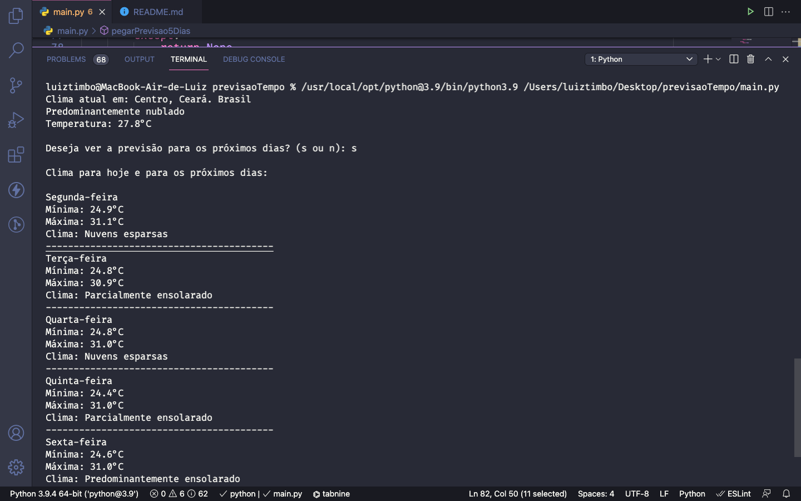
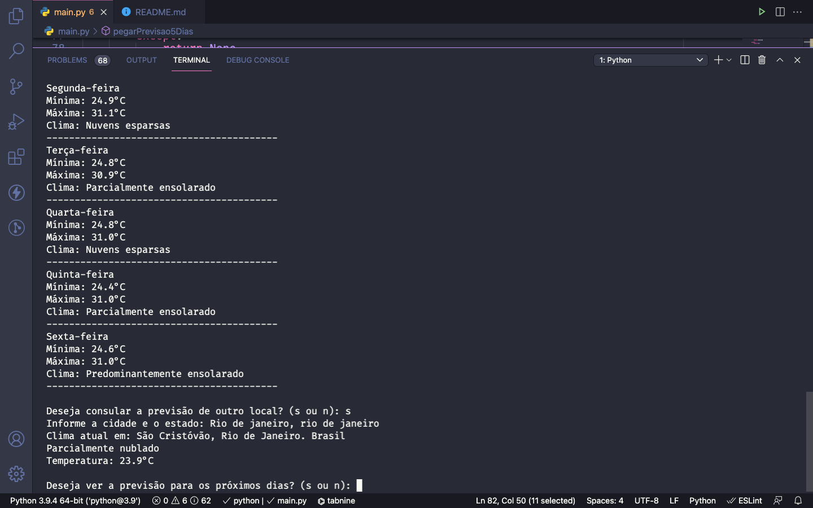

 <h1 align="Left">  
   ☁️ <Strong>Previsão do Tempo</Strong>
 </h1>

<h1 align="center">
  
  
<h1>

# Índice

- [Sobre](#-sobre)
- [Tecnologias Utilizadas](#-tecnologias-utilizadas)
- [Como baixar o projeto](#-como-baixar-o-projeto)
- [Observações](#-Observações)

---

# ☁️ Sobre

Projeto desenvolvido em Python 3 que obtém
a previsão do tempo local do usuário com base no ip da máquina. O sistema tem a opção de informa a previsão para os próximos 5 dias além de permitir que o usuário pesquise a previsão para outras localizações informando cidade e estado.

---

## 💻 Tecnologias utilizadas

O projeto foi desenvolvido utilizando as seguintes tecnologias:

- Python 3;
- Requests;
- Urllib;
- Datetime;
- Accuweather;
- Mapbox;

---

## 📁 Como baixar o projeto

```bash
# Clonar o repositório
  git clone https://github.com/LuizTimboAlcantara/python_previsao_do_tempo.git

# Entrar na pasta do projeto
  $ cd python_previsao_do_tempo

# Instalar as dependências do projeto
  $ pip install

# Rodar a aplicação
  $ F5

```

---

## 🔭 Observações

- O limite de requisições diárias é de 50;

- É aconselhado criar suas próprias chaves nas apis de localização de tempo;
